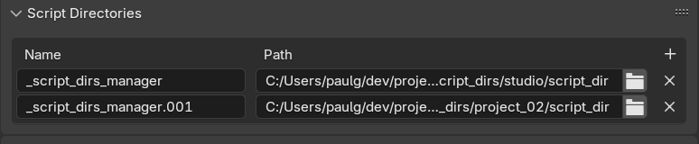

# Blender Script Dirs Manager

Manages the registration of Blender add-ons and the execution of startup scripts from multiple arbitrary script directories.

```bash
export BLENDER_SCRIPT_DIRS="/studio/blender/scripts:/project1/blender/scripts:/artist1/blender/scripts"
```




---

This script processes the non-blender env variable `BLENDER_SCRIPT_DIRS`.
The env variable should contain a list of directories separated by the os.pathsep character.

This script will add all directories in the env variable to the blender script directories in the user preferences.

If the script directory was **not already** present, it will execute all python files in the startup sub-directory
as well as enable all add-ons in the add-ons sub-directory.

Before adding the provided script directories it will remove all script directories that are still in the blender preferences but not in the env variable anymore.

It will also disable all add-ons that were associated with removed script directories.

If you are unsure what the directory layout of a blender script directory is, refer to this link:
https://docs.blender.org/manual/en/latest/advanced/blender_directory_layout.html#path-layout


### How to use it

01. Set the env variable `BLENDER_SCRIPT_DIRS` to a list of script directories separated by the os.pathsep character.

```bash
export BLENDER_SCRIPT_DIRS="/studio/blender/scripts:/project1/blender/scripts"
```

02. Start blender and add this script to the `--python` argument


```bash
blender --python <PATH_TO_THIS_SCRIPT>
```

### Gotchas

If you change the content of the `BLENDER_SCRIPT_DIRS` variable, the manager will remove all entries that are still in the preferences but not present anymore in the variable.

But before the manager can do that, blender will still process the old script directories that are in the preferences before the manager can do something.

Meaning the old add-ons and startup scripts will be registered once before the manager can disable them and remove their script directory entry.
